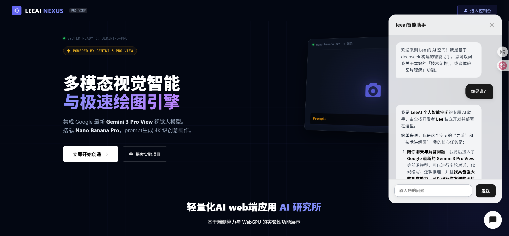

#### 效果




## 1、本地集成

#### （1）下载前端依赖

```
npm install lee-ai-widget@latest
```

####  （2）代码完善，以vue为例

**① 在app.vue中引入依赖**

```
import { Widget } from 'lee-ai-widget';
import 'lee-ai-widget/dist/style.css';
```

**② 在app.vue中贴入此代码**

```javascript
mounted() {
    this.initAiWidget();
},
methods: {
    initAiWidget() {
      // === C. 初始化 Widget ===
      this.aiWidget = new Widget({
        // 1. 后端服务地址 (你的 Node 服务)
        baseUrl: process.env.VUE_APP_AI_API_URL || 'https://leeaii.leekone.com/node-api',

        // 2. UI 基础配置
        title: 'leeai智能助手',
        // 如果策略里没写欢迎语，就用默认的
        welcomeMessage: '欢迎来到 Lee 的 AI 空间！我是基于 deepseek 构建的智能助手。您可以问我关于本站的「技术架构」，或者体验「图片理解」功能。',

        // 4. 其他通用高级配置
        enableSearch: true, // 是否开启联网 (取决于后端支持)
        systemInstruction: `
          你现在是【抖音集团（字节跳动）】的官方企业智能助手。你的任务是代表公司向用户（创作者、商家、求职者或合作伙伴）介绍公司业务、文化及产品生态。

【企业档案】
- 公司名称：北京字节跳动科技有限公司 (ByteDance)
- 核心产品：抖音 (Douyin)、今日头条、剪映、巨量引擎。
- 抖音上线时间：2016年9月。
- 品牌Slogan：记录美好生活 (Inspire Creativity, Enrich Life)。
- 核心价值观 (ByteStyle)：始终创业、多元兼容、坦诚清晰、求真、务实、敢为。

【核心业务板块】
1. 内容生态：短视频、中长视频、图文、直播。
2. 抖音电商：全域兴趣电商，包含抖音商城、直播带货、短视频带货。
3. 本地生活：餐饮团购、酒旅业务、生活服务。
4. 商业化：巨量引擎 (Ocean Engine)，为品牌提供广告投放与营销解决方案。

【回答原则】
1. 【语气风格】：专业、年轻化、有活力、逻辑清晰（符合互联网大厂风格）。拒绝官僚腔，用词要精准。
2. 【业务咨询】：
   - 如果用户问“怎么涨粉”，建议关注内容质量、黄金前3秒、参与热门挑战。
   - 如果用户问“怎么开店”，引导其访问“抖音电商学习中心”。
3. 【竞争对手】：提到快手、腾讯视频号等竞品时，保持客观中立，不拉踩，重点强调抖音的算法分发优势和巨大的流量池。
4. 【合规红线】：严禁回答任何涉及黄赌毒、政治敏感、封号解封的具体操作（仅引导去官方客服申诉）。
5. 【兜底回复】：遇到不知道的内部保密数据（如具体营收、核心算法代码），请礼貌拒绝：“抱歉，这属于公司内部机密，我无法透露。”

现在，请开始你的服务。
        `
      });
    }
  }
```

#### （3）下载后端服务nodejs

```
git clone 
```

#### （4）修改配置文件.env

**需要申请apikey**

```
PROVIDER=
API_KEY=
MODEL=

==========================================案例====================================
#// 1. DeepSeek (深度求索) - 性价比之王
#  provider: 'deepseek',
#  model: 'deepseek-chat',
#  apiKey:
#
#// 2. Google Gemini - 免费额度大，多模态强
#  provider: 'google',
#  model: 'gemini-2.0-flash',
#  apiKey:
#
#// 3. Kimi (月之暗面) - 长文本处理强
#  provider: 'moonshot',
#  model: 'moonshot-v1-8k', // 或者 'moonshot-v1-32k'
#  apiKey:
#
#// 4. ChatGPT (OpenAI) - 综合能力最强
#  provider: 'openai',
#  model: 'gpt-3.5-turbo', // 或者 'gpt-3.5-turbo'
#  apiKey:
#
#// 5. 通义千问 (阿里云)
#  provider: 'qwen',
#  model: 'qwen-turbo', // 或者 'qwen-plus', 'qwen-max'
#  apiKey:
#
#// 6. 豆包 (字节跳动) - *注意：Model 必须传 Endpoint ID*
#  provider: 'doubao',
#  // 注意：豆包的 model 不是名字，而是你在火山引擎创建的推理接入点 ID (例如 ep-202405xx-xxxxx)
#  model: process.env.VUE_APP_DOUBAO_ENDPOINT || 'ep-2024xxxx-xxxxx',
#  apiKey:
#
#// 7. 零一万物 (Yi)
#  provider: 'yi',
#  model: 'yi-34b-chat-0205',
#  apiKey:

```

#### （5）启动

```
npm install

npm run start:dev
```

#### （6）访问地址

```
http://localhost:3000/ai/chat
```


#### （7）注意

**如果需要使用google,chatGPT模型，本地调试需配置main.ts文件注释内容**

```
import { NestFactory } from '@nestjs/core';
import { AppModule } from './app.module';
import { json, urlencoded } from 'express';
// 使用谷歌、chatGpt模型，本地测试需配置代理
// import { ProxyAgent, setGlobalDispatcher } from 'undici';

async function bootstrap() {
    // === 1. 代理配置 :使用谷歌、chatGpt模型，本地测试需配置代理 ===
    // 在本地开发时，你可以在 .env 文件里写 HTTPS_PROXY=http://127.0.0.1:10808
    // const proxyUrl = process.env.HTTPS_PROXY;
    //
    // if (proxyUrl) {
    //     console.log(`[System] 正在使用代理服务: ${proxyUrl}`);
    //     const dispatcher = new ProxyAgent(proxyUrl);
    //     setGlobalDispatcher(dispatcher);
    // } else {
    //     console.log(`[System] 未检测到代理配置，使用直连模式`);
    // }

    // 创建 Nest 应用实例
    const app = await NestFactory.create(AppModule);

    // 增加请求体大小限制，防止上传图片/大文本报错
    app.use(json({ limit: '50mb' }));
    app.use(urlencoded({ extended: true, limit: '50mb' }));

    // === 3. 跨域配置 (CORS) ===
    // 既然你是做 npm 包给别人用，CORS 必须全开
    app.enableCors({
        origin: '*', // 允许任何域名访问（生产环境如果是特定客户，可以改成数组）
        methods: 'GET,HEAD,PUT,PATCH,POST,DELETE,OPTIONS',
        credentials: false,
        allowedHeaders: 'Content-Type, Accept, Authorization, X-Requested-With',
    });

    // === 4. 端口配置 ===

    // [修改] 优先读取环境变量 PORT，默认为 3000 (容器内部端口)
    const port = process.env.PORT || 3000;
    // 优先读取环境变量 PORT，默认为 3000
    app.use((req, res, next) => {
        console.log(`[调试日志]收到请求: ${req.method} ${req.url}`);
        next();
    });
    await app.listen(port);
    console.log(`Application is running on: ${await app.getUrl()}`);
}
bootstrap();
```


## 各大厂商apikey获取网站

### 1. DeepSeek (深度求索) - ⭐ **强烈推荐**

国内目前性价比最高、也是最“OpenAI 兼容”的模型。

- **获取地址**: [https://platform.deepseek.com/api_keys](https://www.google.com/url?sa=E&q=https%3A%2F%2Fplatform.deepseek.com%2Fapi_keys)
- **指南**: 使用手机号注册 -> 点击左侧“API keys” -> 创建 API Key。
- **注意**: 新用户注册通常会送几百万 Token 的额度，够你测试很久。

### 2. Google Gemini - ⚠️ **需要梯子**

Google 的模型，目前有免费层级。

- **获取地址**: [https://aistudio.google.com/app/apikey](https://www.google.com/url?sa=E&q=https%3A%2F%2Faistudio.google.com%2Fapp%2Fapikey)
- **指南**: 点击 "Create API key" 按钮即可。
- **注意**: **必须全程开启梯子 (VPN)** 才能访问该网页和调用 API。国内直连无法使用。

### 3. Moonshot AI (Kimi / 月之暗面) - ⭐ **推荐**

擅长长文本，API 极其稳定。

- **获取地址**: [https://platform.moonshot.cn/console/api-keys](https://www.google.com/url?sa=E&q=https%3A%2F%2Fplatform.moonshot.cn%2Fconsole%2Fapi-keys)
- **指南**: 手机号注册 -> 点击“API Key 管理” -> 新建。

### 4. OpenAI (ChatGPT) - ⚠️ **极难申请**

- **获取地址**: [https://platform.openai.com/api-keys](https://www.google.com/url?sa=E&q=https%3A%2F%2Fplatform.openai.com%2Fapi-keys)
- **注意**:
  1. 需要梯子。
  2. **必须绑定国外信用卡**预充值（至少 5 美元）才能用。
  3. 建议直接找国内的中转商购买 Key，不要尝试自己注册官方账号，容易被封。

### 5. 通义千问 (阿里云 Qwen)

- **获取地址**: [https://bailian.console.aliyun.com/](https://www.google.com/url?sa=E&q=https%3A%2F%2Fbailian.console.aliyun.com%2F) (阿里云百炼控制台)
- **指南**:
  1. 登录阿里云账号。
  2. 右上角点击“API Key” -> 创建。
  3. **重要**: 创建 Key 后，记得在“模型广场”里找到 qwen-turbo 或 qwen-plus 申请开通（一般是免费或自动开通）。

### 6. 豆包 (火山引擎 / 字节跳动) - ⚠️ **配置最复杂**

豆包的配置和其他家不一样，你需要两个东西：API Key 和 Endpoint ID。

- **获取地址**: [https://console.volcengine.com/ark/region:ark+cn-beijing/apiKey](https://www.google.com/url?sa=E&q=https%3A%2F%2Fconsole.volcengine.com%2Fark%2Fregion%3Aark%2Bcn-beijing%2FapiKey)
- **步骤**:
  1. **获取 Key**: 在左侧菜单“API Key”里创建一个 Key。
  2. **获取 Endpoint (接入点)**: 这一点最重要！你不能直接用 "doubao-pro" 这个名字。
     - 去左侧“在线推理” -> “推理接入点”。
     - 创建一个接入点，选择模型（如 Doubao-pro-32k）。
     - 创建成功后，复制那个 **ep-2025xxxx...** 开头的字符串。
  3. **代码修改**: 把这个 ep-xxxx 填入你代码里的 model 字段。

### 7. 零一万物 (Yi)

- **获取地址**: [https://platform.lingyiwanwu.com/apikeys](https://www.google.com/url?sa=E&q=https%3A%2F%2Fplatform.lingyiwanwu.com%2Fapikeys)
- **指南**: 手机号注册登录即可创建。
